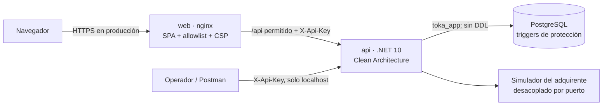

# Checkout con tarjeta — prototipo full stack

Plataforma de comercio electrónico donde un cliente nuevo compra un producto con tarjeta: registro del cliente, creación de la orden, validación, autorización de pago simulada, actualización de inventario, bitácora de eventos, consulta de estado y manejo de rechazos y reintentos.

**Stack:** .NET 10 Web API (Clean Architecture) · PostgreSQL 17 con EF Core · React + TypeScript + Vite · nginx · Docker Compose · xUnit + Testcontainers · Vitest.

---

## Ejecutarlo

Requisitos: Docker Desktop y `openssl`.

```bash
./scripts/init-env.sh          # crea .env con secretos aleatorios (una sola vez)
docker compose up --build      # db → api → web, cada uno espera a que el anterior esté sano
./scripts/smoke.sh             # opcional: verificación de punta a punta
```

Cada push y pull request pasa por el [pipeline DevSecOps](docs/07-operacion.md#76-pipeline-de-integración-continua-devsecops) (GitHub Actions): pruebas, SCA, SAST con CodeQL, detección de secretos, escaneo de imágenes con Trivy y E2E con Docker Compose.

| Qué | Dónde |
|---|---|
| Aplicación web | http://localhost:5173 |
| Swagger (solo desde tu máquina) | http://localhost:8080/swagger — usa la `API_KEY` de `.env` |
| Colección Postman | [`postman/`](postman/) |

Pruebas automatizadas (requieren Docker para PostgreSQL en Testcontainers):

```bash
dotnet test                    # 82 unitarias + 29 de integración
cd web && npm ci && npm test   # 10 del frontend
```

### Tarjetas de prueba del simulador

| Tarjeta | Resultado |
|---|---|
| `4111 1111 1111 1111` · `5555 5555 5555 4444` | Aprobada (crédito, permite MSI) |
| `4000 0000 0000 0002` | Rechazada: fondos insuficientes |
| `4000 0000 0000 0259` | Falla el primer intento y se aprueba en el reintento automático |
| `4000 0000 0000 0119` | El procesador no responde: pago no procesado tras 3 intentos |
| `4000 0000 0000 0341` | Tiempo de espera agotado: pago no procesado |
| `4000 0566 5566 5556` · `5200 8282 8282 8210` | Débito: solo pago de contado |

Cualquier fecha futura y CVV de 3 dígitos. 3 MSI desde $1,500 y 6 MSI desde $3,000.

---

## Vista general



- **Backend en capas:** `Domain` (reglas e invariantes) ← `Application` (casos de uso, puertos) ← `Infrastructure` (EF Core, simulador, bitácora) ← `Api` (HTTP). Las dependencias apuntan hacia el dominio.
- **Flujo de compra:** se aparta el stock y se crea la orden en una transacción; luego se autoriza el pago con reintentos solo ante errores temporales. Si el pago se rechaza o falla, el stock se libera y la orden puede reintentarse con otra tarjeta.
- **Seguridad primero:**
  - La API key vive solo en el servidor.
  - La web expone únicamente 5 rutas.
  - La tarjeta nunca se guarda completa.
  - La base de datos impide alterar montos y bitácora, salvo por una vía de emergencia con permisos y auditada.

---

## Documentación

Se recomienda leerla en este orden:

| # | Documento | Contenido |
|---|---|---|
| 1 | [Contexto y alcance](docs/01-contexto-y-alcance.md) | Caso de negocio, flujo funcional, reglas y decisiones de producto |
| 2 | [Arquitectura](docs/02-arquitectura.md) | Contexto, contenedores, capas, secuencias, SOLID con ejemplos de código, decisiones |
| 3 | [Modelo de datos](docs/03-modelo-de-datos.md) | Diagrama ER, tablas, restricciones, triggers, roles, migraciones |
| 4 | [Seguridad](docs/04-seguridad.md) | Riesgos priorizados, OWASP Top 10, secretos, datos de tarjeta, datos personales |
| 5 | [API](docs/05-api.md) | Endpoints, errores, idempotencia, límites, Swagger y Postman |
| 6 | [Pruebas y evidencia](docs/06-pruebas.md) | Estrategia, resultados, cobertura, pruebas de humo |
| 7 | [Operación](docs/07-operacion.md) | Configuración, despliegue, observabilidad, preparación para producción |
| 8 | [Limitaciones y evolución](docs/08-limitaciones-y-evolucion.md) | Qué no cubre esta demo y la hoja de ruta priorizada |
| — | [Runbook: corrección de datos](docs/runbooks/correccion-de-datos.md) | Procedimiento de emergencia para corregir datos protegidos |

## Estructura del repositorio

```
src/
  Toka.Domain/          entidades, invariantes, IVA, MSI, estados
  Toka.Application/     casos de uso, validaciones, puertos (repositorios, adquirente, bitácora)
  Toka.Infrastructure/  EF Core + PostgreSQL, migraciones, simulador, bitácora
  Toka.Api/             controllers, seguridad HTTP, ProblemDetails, logging, Dockerfile
tests/
  Toka.UnitTests/       dominio y aplicación sin infraestructura
  Toka.IntegrationTests/ API real + PostgreSQL en contenedor con los roles de producción
web/                    React + TypeScript + Vite, nginx (allowlist, CSP), Dockerfile
deploy/postgres/init/   creación de roles de base de datos
scripts/                init-env.sh (secretos), smoke.sh (E2E), check-dependencies.sh (SCA)
.github/                pipeline de CI (DevSecOps), CodeQL y Dependabot
docs/                   documentación técnica y runbooks
postman/                colección y entorno
```
