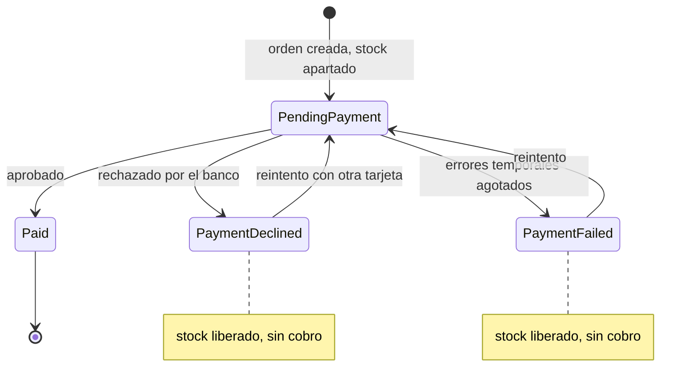

# 1. Contexto y alcance

## Caso de negocio

Un cliente nuevo compra un producto con tarjeta. El sistema debe:

| Requisito | Cómo se cumple |
|---|---|
| Registrar al cliente | En el checkout se registra por correo; si ya existe, se reutiliza sin sobrescribir sus datos. También existe `POST /customers`. |
| Crear la orden de compra | La orden se crea junto con la reserva de inventario, en una sola transacción. |
| Validar información obligatoria | Validación en el backend (FluentValidation + invariantes de dominio); en el frontend solo para la experiencia de uso. |
| Simular autorización de pago | Simulador desacoplado detrás del puerto `IPaymentGateway`, con escenarios deterministas por número de tarjeta. |
| Actualizar inventario | Stock apartado al crear la orden y liberado si el pago se rechaza o falla. Concurrencia optimista: nunca se vende de más. |
| Registrar bitácora de eventos | Tabla `audit_events` de solo inserción, con descripción en español y CorrelationId. |
| Consultar el estado de la orden | Con número de orden + correo del comprador, o desde "Mis compras" en el mismo navegador. |
| Manejar errores, rechazos y reintentos | Reintentos automáticos con backoff ante errores temporales; rechazo sin reintento; reintento manual con otra tarjeta; idempotencia para no cobrar dos veces. |

## Flujo funcional

| Estado técnico | Etiqueta al usuario | Significado |
|---|---|---|
| `PendingPayment` | Pago en proceso | Stock apartado, autorizando con el adquirente |
| `Paid` | Pago aprobado | Cobro autorizado, con código de autorización |
| `PaymentDeclined` | Pago rechazado | El emisor rechazó la tarjeta; no se reintenta automáticamente porque la respuesta no cambiaría |
| `PaymentFailed` | Pago no procesado | El adquirente no respondió después de 3 intentos |

## Reglas de negocio

| Regla | Detalle |
|---|---|
| **Precios con IVA incluido** | Al consumidor se le muestra el precio final. La orden guarda subtotal, tasa (16%) e IVA; el IVA es la diferencia, así que `subtotal + IVA = total` siempre cuadra. |
| **Meses sin intereses** | 3 MSI desde $1,500 y 6 MSI desde $3,000, configurables. Sin intereses: el total no cambia. |
| **Redondeo de MSI** | Los pagos se truncan al centavo y el **primero absorbe la diferencia** ($100 a 3 MSI = $33.34 + $33.33 + $33.33). |
| **Tarjetas de débito** | Se identifican por BIN y se aceptan solo de contado. Pedir MSI con débito responde 422. |
| **Cantidad** | De 1 a 10 unidades por orden, limitada por el stock disponible. |
| **Idempotencia** | El mismo `Idempotency-Key` devuelve la orden original: un doble clic o un reintento de red no cobra dos veces. |
| **Consulta de órdenes** | Requiere número de orden y correo del comprador. Un correo que no coincide responde igual que una orden inexistente. |
| **Idioma** | Todo lo que ve el usuario está en español; los identificadores técnicos (código, códigos de error, eventos) en inglés. |

## Decisiones de producto tomadas durante el desarrollo

Cada una la decidió el ingeniero responsable, evaluando alternativas con sus pros y contras.

| Tema | Decisión |
|---|---|
| Pago rechazado en la API | `201 Created` con el estado en el cuerpo: la orden existe aunque el cobro no. |
| Regularización fiscal | Desglose de IVA, montos inmutables y bitácora como evidencia. |
| Datos protegidos | Bloqueados por defecto en la base de datos, con una vía de corrección de emergencia con permisos y auditada. |
| Consulta sin sesión | Orden + correo y listado local del dispositivo. El login de clientes queda fuera de esta demo. |
| Notificaciones | Avisos dentro de la aplicación, no Web Push: todo el flujo ocurre con el usuario presente. |
| Diseño | Checkout por pasos estilo Apple, con paleta y tipografía de referencia sin usar la marca. Estados reales, sin textos de marketing. |
| Secretos | `.env` generado con valores aleatorios; nunca hay credenciales en el repositorio. |

## Fuera de alcance

Integración con un adquirente real, facturación electrónica (CFDI), cuentas de cliente con login, envíos y multi-producto por orden. Ver [limitaciones y evolución](08-limitaciones-y-evolucion.md).
