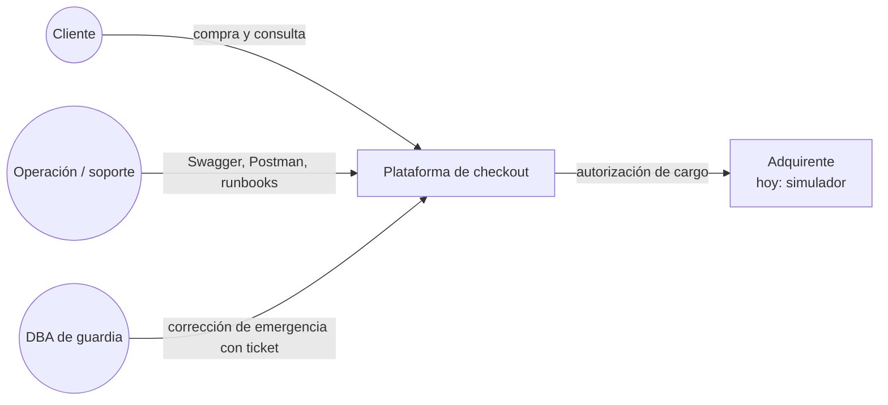
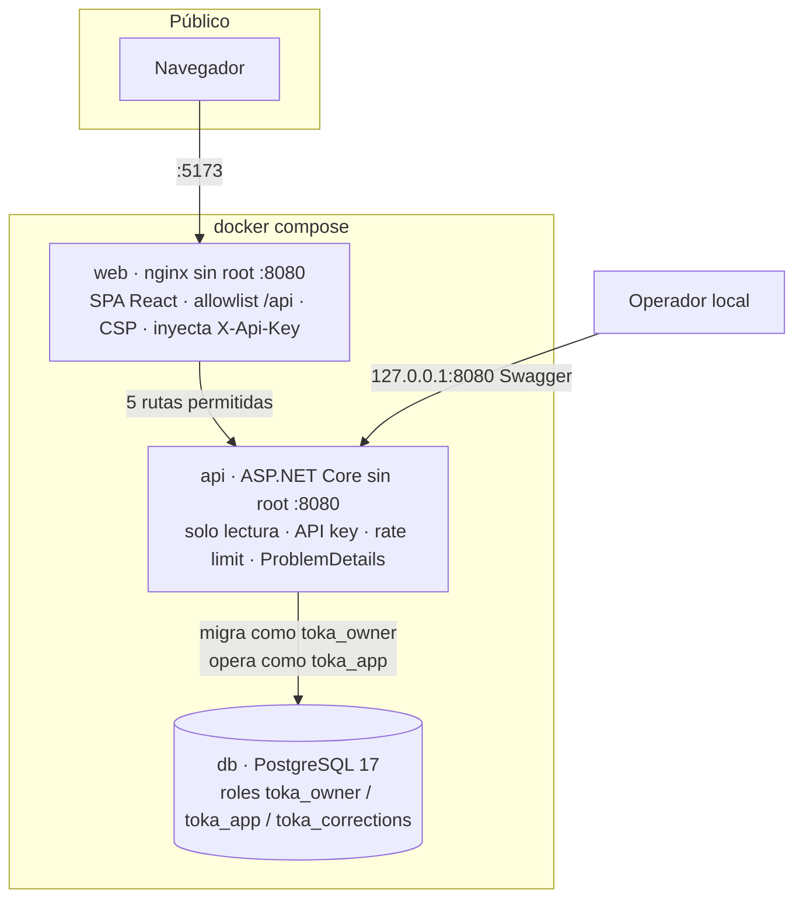
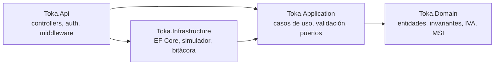
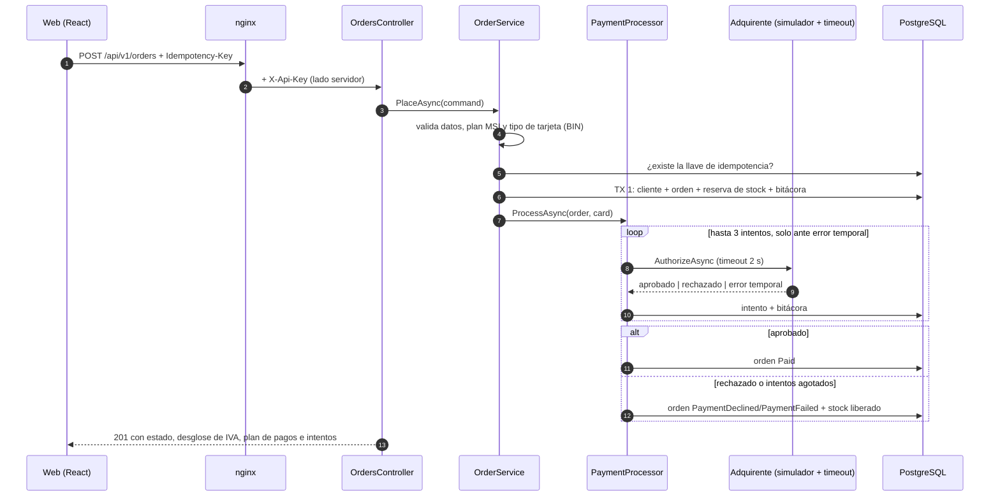

# 2. Arquitectura

La misma arquitectura vista desde cuatro niveles: sistema, contenedores, capas del backend y secuencia de una compra.

## 2.1 Contexto del sistema



## 2.2 Contenedores



| Contenedor | Responsabilidad | Endurecimiento |
|---|---|---|
| `web` | Sirve la SPA y hace de proxy de la API | Usuario sin root (uid 101), sistema de archivos de solo lectura, sin capabilities, allowlist de rutas y métodos, CSP y cabeceras de seguridad |
| `api` | Casos de uso, validación, seguridad HTTP | Usuario sin root (uid 1654), solo lectura, sin capabilities, publicada solo en `127.0.0.1` |
| `db` | Persistencia y protección de datos de evidencia | Sin puerto publicado; la API no puede cambiar el esquema ni corregir datos protegidos |

## 2.3 Capas del backend (Clean Architecture)



| Capa | Contiene | No depende de |
|---|---|---|
| **Domain** | `Order` (máquina de estados), `Product` (reserva y liberación de stock), `Customer`, `PaymentAttempt`, `AuditEvent`, `TaxBreakdown`, `InstallmentSchedule`, `CardType` | Nada: no referencia ningún paquete |
| **Application** | `OrderService`, `PaymentProcessor`, `CustomerService`, `InstallmentPolicy`; validadores; puertos `IPaymentGateway`, `ICardBinLookup`, `IAuditLog`, repositorios, `IUnitOfWork` | EF Core, HTTP, PostgreSQL |
| **Infrastructure** | `AppDbContext`, configuraciones, migraciones, repositorios, `UnitOfWork`, `AuditLog`, `SimulatedPaymentGateway`, `TimeoutPaymentGateway` (Polly), `SimulatedCardBinLookup` | HTTP |
| **Api** | Controllers `/api/v1`, `ApiKeyAuthenticationHandler`, correlación, cabeceras de seguridad, manejo global de errores, rate limiting, Swagger | — (composición de todo) |

Las reglas de negocio viven en el dominio, no en los controllers ni en la base de datos. La base de datos agrega una **segunda línea de defensa** (CHECK y triggers) para los datos que sirven como evidencia.

## 2.4 Secuencia de una compra



**Por qué dos transacciones:** la llamada al adquirente no puede quedar dentro de una transacción de base de datos, porque bloquearía filas durante segundos y un timeout dejaría todo en duda. Primero se confirma la reserva y después se registra cada intento, así ningún resultado se pierde aunque el proceso se detenga a la mitad.

## 2.5 SOLID en el código

**S — Responsabilidad única.** Cada clase tiene una sola razón para cambiar. El ciclo de reintentos está en `PaymentProcessor`; el límite de tiempo, en un decorador aparte:

```csharp
// Toka.Infrastructure/Payments/TimeoutPaymentGateway.cs
public async Task<PaymentResponse> AuthorizeAsync(PaymentRequest request, CancellationToken ct) =>
    await _pipeline.ExecuteAsync(async token => await _inner.AuthorizeAsync(request, token), ct);
```

**O — Abierto/cerrado.** Cambiar el simulador por un adquirente real consiste en agregar una implementación de `IPaymentGateway` y registrarla. No se modifica ningún caso de uso.

**L — Sustitución de Liskov.** `TimeoutPaymentGateway` y `SimulatedPaymentGateway` son intercambiables detrás de `IPaymentGateway`. Las pruebas usan un tercero, `ScriptedGateway`, sin que `PaymentProcessor` note la diferencia.

**I — Segregación de interfaces.** Puertos pequeños por necesidad: `ICardBinLookup` expone un solo método y `IAuditLog` solo registrar y consultar. Ningún consumidor depende de métodos que no usa.

**D — Inversión de dependencias.** La aplicación define los contratos y la infraestructura los implementa:

```csharp
// Toka.Application/Payments/IPaymentGateway.cs
public interface IPaymentGateway
{
    Task<PaymentResponse> AuthorizeAsync(PaymentRequest request, CancellationToken ct);
}

// Toka.Infrastructure/DependencyInjection.cs
services.AddSingleton<IPaymentGateway>(sp => new TimeoutPaymentGateway(
    sp.GetRequiredService<SimulatedPaymentGateway>(), ...));
```

**Invariantes en el dominio.** Una orden no puede quedar pagada dos veces ni perder stock al cerrarse. La propia entidad lo impide:

```csharp
// Toka.Domain/Orders/Order.cs
public static Order Place(Guid customerId, Product product, int quantity, int installments, ...)
{
    product.Reserve(quantity);                       // falla si no hay stock
    var tax = TaxBreakdown.FromTaxIncludedTotal(product.Price * quantity);
    ...
}

public void MarkDeclined(Product product, string reason, DateTimeOffset now) =>
    Close(product, OrderStatus.PaymentDeclined, reason, now);   // libera el stock
```

**Errores de negocio como valores.** Los rechazos esperados no se lanzan como excepciones: viajan como `Result<T>` y la API los traduce a HTTP en un solo lugar:

```csharp
// Toka.Api/Infrastructure/ResultExtensions.cs
ErrorType.Validation => 400, ErrorType.NotFound => 404, ErrorType.Conflict => 409, _ => 422
```

## 2.6 Decisiones de arquitectura

| # | Decisión | Alternativa descartada | Motivo |
|---|---|---|---|
| 1 | Reintentos en `PaymentProcessor` (Application) | Reintentos con Polly en Infrastructure | Cada intento debe quedar registrado como `PaymentAttempt` y en la bitácora; Polly quedó para el timeout. |
| 2 | Servicios de casos de uso simples | MediatR | Menos indirección y sin licencias; para seis casos de uso no aporta. |
| 3 | Concurrencia optimista (`Version` en `Product`) | Bloqueos pesimistas | Contención baja; ante conflicto se responde 409 y el cliente reintenta de forma idempotente. |
| 4 | Ids Guid v7 generados en el dominio | Identidad de base de datos | Las entidades existen completas antes de persistirse; los ids son ordenables por tiempo. |
| 5 | Protección de datos en PostgreSQL (triggers + roles) | Solo validación en código | Un bug o un acceso directo a la base no puede alterar montos ni bitácora; existe una vía de emergencia auditada. |
| 6 | Proxy nginx con API key del lado servidor | Llamar a la API desde el navegador con la key | Una llave en el bundle de JavaScript es pública. |
| 7 | Mensajes al usuario en español; código en inglés | Todo en un idioma | Único idioma soportado por ahora; los identificadores técnicos siguen siendo estables para integrar. |
| 8 | Monolito modular | Microservicios | Un solo dominio transaccional; separar costaría consistencia sin beneficio en esta escala. |
