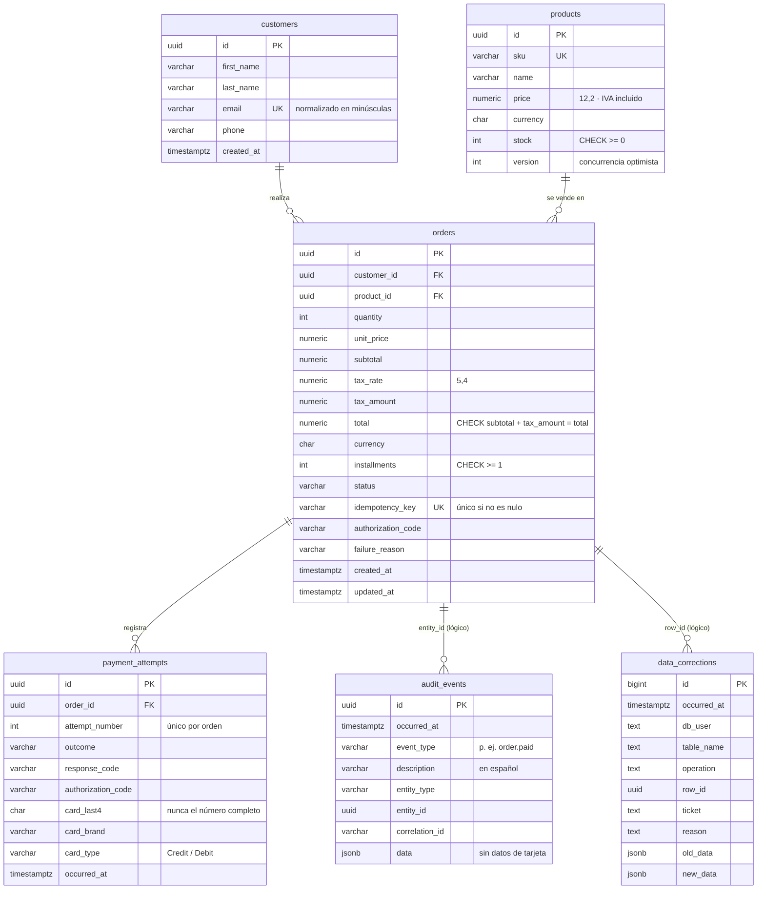

# 3. Modelo de datos

PostgreSQL 17. Nombres en `snake_case`, montos en `numeric` (nunca `float`), fechas en `timestamptz` (UTC).

## 3.1 Diagrama entidad-relación



## 3.2 Qué se guarda de una tarjeta

| Dato | ¿Se guarda? | Dónde |
|---|---|---|
| Número completo (PAN) | **No** | Solo en memoria durante la petición |
| CVV | **No** | Solo en memoria durante la petición |
| Titular y vencimiento | **No** | Solo en memoria durante la petición |
| Últimos 4 dígitos, marca, crédito o débito | Sí | `payment_attempts` |

## 3.3 Restricciones de integridad

| Restricción | Protege contra |
|---|---|
| `ck_products_stock_non_negative` | Vender más de lo disponible, aunque falle la lógica de la aplicación |
| `products.version` como token de concurrencia | Dos compras simultáneas que descuentan el mismo stock |
| `ck_orders_tax_breakdown` (`subtotal + tax_amount = total`) | Montos fiscales que no cuadran |
| `ck_orders_installments_positive` | Planes de pago inválidos |
| Índice único filtrado en `orders.idempotency_key` | Dos órdenes por la misma solicitud, incluso con peticiones concurrentes |
| Único `(order_id, attempt_number)` | Intentos de pago duplicados o reordenados |
| Único `customers.email` y `products.sku` | Duplicados |

## 3.4 Protección de datos de evidencia

La migración `DataProtection` agrega triggers que aplican **aunque se acceda a la base de datos por fuera de la API**:

| Tabla | Regla |
|---|---|
| `orders` | La API puede actualizar el estado y los datos de pago. **Montos, plan de pagos, cliente, producto, fecha e idempotency key son inmutables.** No se permite borrar. |
| `payment_attempts`, `audit_events` | Solo inserción |
| `data_corrections` | Solo inserción, sin excepción |
| Todas las anteriores | `TRUNCATE` bloqueado |

La única forma de modificarlas es la corrección de emergencia: rol `toka_corrections` + ticket + motivo, con registro automático del valor anterior y el nuevo. Procedimiento en el [runbook](runbooks/correccion-de-datos.md).

## 3.5 Roles de base de datos

| Rol | Puede | No puede |
|---|---|---|
| `toka_owner` | Ser dueño del esquema y correr migraciones | — (sus credenciales no las usa la API) |
| `toka_app` (API) | Leer, insertar y actualizar clientes, productos y órdenes; insertar intentos y bitácora | Borrar, cambiar el esquema, alterar datos protegidos, leer `data_corrections` |
| `toka_corrections` | Corregir datos protegidos declarando ticket y motivo | Iniciar sesión (se otorga temporalmente a un DBA con nombre) |

Los roles se crean en [`deploy/postgres/init/01-roles.sh`](../deploy/postgres/init/01-roles.sh) al inicializar el volumen de Docker.

## 3.6 Migraciones

En `src/Toka.Infrastructure/Persistence/Migrations`; se aplican al arrancar la API con el rol dueño:

| Migración | Cambio |
|---|---|
| `InitialCreate` | Esquema base y catálogo de ejemplo (4 productos) |
| `TaxBreakdown` | Subtotal, tasa e IVA; recalcula órdenes previas; CHECK fiscal |
| `DataProtection` | Roles, permisos, `data_corrections`, triggers de protección y corrección de emergencia |
| `Installments` | Plan de pagos (MSI) y su inclusión en las columnas protegidas |
| `PaymentAttemptCardType` | Tipo de tarjeta (crédito o débito) en cada intento |

Todas incluyen `Down` para revertir. Para generar el script SQL completo:

```bash
dotnet ef migrations script -p src/Toka.Infrastructure -s src/Toka.Infrastructure -o schema.sql
```
