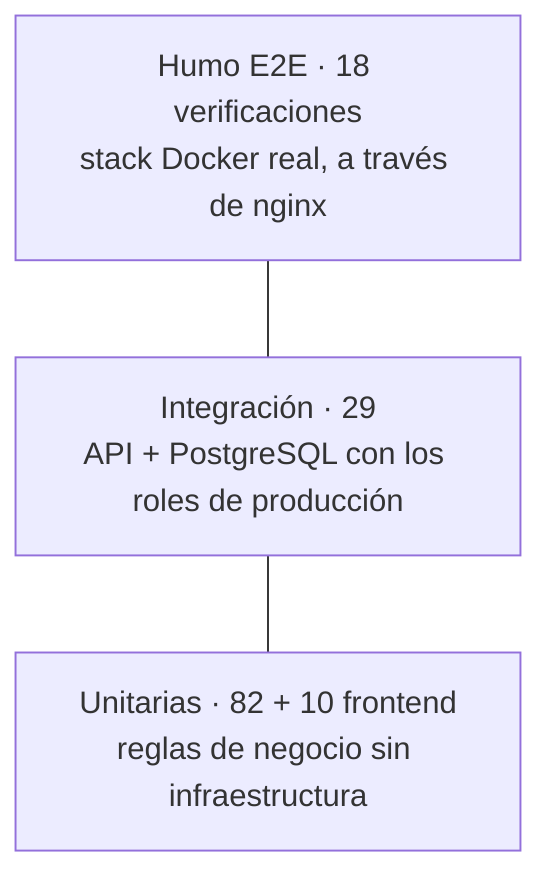

# 6. Pruebas y evidencia

Resultados completos, prueba por prueba: [evidencia/resultados-pruebas.md](evidencia/resultados-pruebas.md).

## Resumen

| Nivel | Herramienta | Pruebas | Resultado |
|---|---|---|---|
| Unitarias (dominio y aplicación) | xUnit | 82 | ✅ 82/82 |
| Integración (API real + PostgreSQL 17) | xUnit + `WebApplicationFactory` + Testcontainers | 29 | ✅ 29/29 |
| Frontend (reglas de tarjeta, teléfono, validación, MSI) | Vitest | 10 | ✅ 10/10 |
| Humo de punta a punta (navegador → nginx → API → BD) | `scripts/smoke.sh` | 18 verificaciones | ✅ 18/18 |
| Contrato de la API | Colección Postman ejecutada con Newman | 18 requests, 22 aserciones | ✅ 22/22 |

**Cobertura de líneas:** unitarias, Domain 87.8% y Application 81.5%; integración, Domain 95.0%, Application 97.3%, Infrastructure 96.5% y Api 78.7%.

## Estrategia



**Unitarias.** Reglas que no pueden fallar, probadas sin base de datos, con fakes escritos a mano (sin librerías de mocks):
- **Dominio:** máquina de estados de la orden; reserva y liberación de stock; desglose de IVA verificado en ~14,000 montos; MSI con el primer pago absorbiendo el redondeo, verificado en ~77,000 combinaciones.
- **Aplicación:** validaciones con sus mensajes en español; ciclo de reintentos (aprobado, rechazado, error temporal, reintentos agotados, excepción del adquirente); idempotencia; débito sin MSI; consulta por correo.
- **Infraestructura aislada:** escenarios del simulador y timeout con Polly.

**Integración.** La API real contra un PostgreSQL desechable, **conectándose con el rol restringido `toka_app` igual que en producción**:
- Flujos completos: aprobado, rechazado y reintento, error temporal, timeout, MSI, débito, idempotencia.
- Contrato HTTP: validación con errores por campo, JSON mal formado, 404, 409, 422, `application/problem+json`, CorrelationId en la bitácora.
- Seguridad: 401 sin llave o con llave incorrecta; consulta con correo ajeno; cabeceras.
- **Protección en BD:** la app no puede cambiar montos, plan de pagos ni bitácora. Un DBA sin ticket es rechazado; con ticket, la corrección se aplica y queda registrada.
- **Concurrencia:** 8 compras simultáneas del producto con stock 2 nunca venden de más.

**Humo E2E.** Recorre el camino del navegador contra `docker compose`: catálogo, formas de pago, checkout, rechazo, reintento, débito, consulta, y la superficie expuesta (rutas bloqueadas, métodos no permitidos, CSP, API key ausente del bundle).

## Cómo ejecutarlas

```bash
dotnet test                                        # unitarias + integración (requiere Docker)
dotnet test --collect:"XPlat Code Coverage"        # con cobertura (Cobertura XML)
cd web && npm test                                 # frontend
./scripts/smoke.sh                                 # E2E con el stack levantado
docker run --rm --network toka-checkout_default -v "$PWD/postman:/etc/newman" postman/newman:6-alpine \
  run toka-checkout.postman_collection.json -e local.postman_environment.json \
  --env-var baseUrl=http://api:8080 --env-var apiKey=<API_KEY de .env>   # colección Postman
```

Las mismas pruebas corren automáticamente en el [pipeline de CI](07-operacion.md#76-pipeline-de-integración-continua-devsecops) en cada push y pull request.

> El rate limit de checkout (10 por minuto) también aplica a `smoke.sh`: si lo corres varias veces seguidas, espera un minuto entre corridas.

## Bugs encontrados por las pruebas durante el desarrollo

| Bug | Cómo se detectó | Corrección |
|---|---|---|
| Los errores salían como `application/json` en lugar de `application/problem+json` | Prueba de integración de validación | Se quitó `[Produces]`, que imponía el tipo a todas las respuestas |
| Suma de MSI inexacta ($100 a 3 MSI daba $99.99) | Revisión del ingeniero; ahora cubierto con una prueba de propiedad | `InstallmentSchedule`: el primer pago absorbe la diferencia |
| nginx no arrancaba con el sistema de archivos de solo lectura | Verificación del stack de Docker | `tmpfs` con el uid del usuario sin root |
| La migración dejaba un tipo de tarjeta vacío en intentos previos | Revisión de la migración antes del commit | Valor por defecto `Unknown` |
