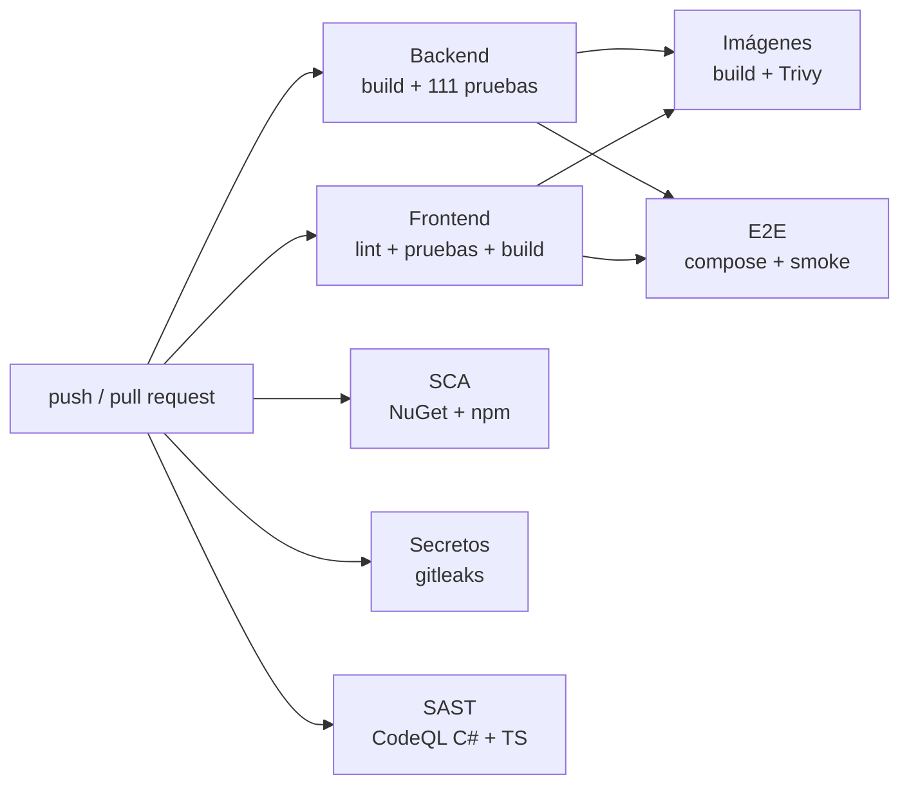

# 7. Operación

## 7.1 Despliegue local

```bash
./scripts/init-env.sh        # .env con secretos aleatorios (no sobrescribe uno existente)
docker compose up --build    # arranque ordenado por health checks: db → api → web
docker compose down          # detener (los datos persisten en el volumen db-data)
docker compose down -v       # detener y borrar la base de datos
```

**Qué pasa al arrancar:**
1. `db` crea los roles en el primer inicio del volumen.
2. `api` aplica las migraciones pendientes como `toka_owner` y opera como `toka_app`.
3. `web` genera su configuración de nginx con la API key y solo empieza cuando la API está sana.

## 7.2 Configuración

Toda la configuración viene de variables de entorno (sección `__` de ASP.NET Core). No hay secretos en `appsettings.json`.

| Variable | Uso | Valor por defecto |
|---|---|---|
| `ConnectionStrings__Default` | Conexión de la API (`toka_app`) | — (obligatoria) |
| `ConnectionStrings__Migrations` | Conexión para migrar (`toka_owner`) | Usa `Default` |
| `Security__ApiKeys__0..n` | API keys aceptadas (permite rotar con dos activas) | — |
| `Database__MigrateOnStartup` | Migrar al arrancar | `false` (`true` en compose) |
| `Swagger__Enabled` | Publicar Swagger | `false` (`true` en compose, solo en localhost) |
| `Cors__AllowedOrigins__n` | Orígenes permitidos (solo para desarrollo; en compose la web es del mismo origen) | vacío |
| `RateLimiting__GlobalPerMinute` / `CheckoutPerMinute` / `LookupPerMinute` | Límites por IP | 120 / 10 / 20 |
| `Payments__MaxAttempts` / `Payments__BaseRetryDelay` | Reintentos ante error temporal | 3 / 200 ms (backoff exponencial) |
| `Installments__Plans__n__Months` / `MinimumAmount` | Planes MSI | 3 MSI desde $1,500 y 6 MSI desde $3,000 |
| `PaymentSimulator__Timeout` / `Latency` / `CardLimit` / `DebitBins` | Comportamiento del simulador | 2 s / 150 ms / $100,000 / `400005`, `520082` |

## 7.3 Observabilidad

| Señal | Implementación |
|---|---|
| **Logs** | JSON estructurado (Serilog, formato compacto) a stdout, un evento por línea, listo para Loki, ELK o CloudWatch. |
| **Correlación** | `X-Correlation-Id` recibido o generado; aparece en cada log, en cada evento de la bitácora, en la respuesta y en los errores que ve el usuario ("Referencia para soporte"). |
| **Bitácora de negocio** | `audit_events`: cada paso de la orden, legible en español y consultable por orden. |
| **Salud** | `/health/live` (proceso) y `/health/ready` (proceso + BD), usados por los health checks de Docker. |
| **Métricas sugeridas** | Tasa de aprobación, rechazo y fallo por minuto; latencia del adquirente; reintentos por orden; respuestas 429. Ver hoja de ruta. |

Para seguir una petición: el usuario reporta la referencia que vio en pantalla → `docker compose logs api | grep <correlationId>` → mismos eventos en `audit_events`.

## 7.4 Incidentes

- **Corregir datos protegidos:** [runbook de corrección de datos](runbooks/correccion-de-datos.md).
- **El adquirente no responde:** las órdenes quedan en `Pago no procesado` sin cobro y con el stock liberado; el cliente puede reintentar. No se requiere intervención manual.
- **Rotar la API key:** agregar la nueva como `Security__ApiKeys__1`, actualizar nginx, retirar la anterior.

## 7.5 Preparación para producción

El diseño está pensado para producción, pero esta entrega es una demo. Esto es lo que ya cumple y lo que falta antes de operar con dinero real:

| Área | Ya cumple | Falta para producción |
|---|---|---|
| Pagos | Puerto desacoplado, timeout, reintentos, idempotencia | Adquirente real con **tokenización** (el PAN no debe llegar al backend), 3-D Secure y conciliación |
| Transporte | nginx como punto de entrada único | TLS en el borde (balanceador o ingress) y HSTS |
| Secretos | Nada en el repositorio, generados aleatoriamente | Gestor de secretos con rotación |
| Base de datos | Roles de mínimo privilegio, triggers de protección, migraciones versionadas | BD administrada con respaldos, PITR y cifrado en reposo; migraciones como paso de despliegue separado |
| Contenedores | Sin root, solo lectura, sin capabilities, health checks, escaneo con Trivy en CI | Firma de imágenes (cosign) y registro privado |
| Observabilidad | Logs estructurados con correlación, bitácora de negocio, health checks | Métricas y alertas (OpenTelemetry), tableros |
| CI/CD | Pipeline en GitHub Actions: build, pruebas, SCA, SAST, secretos, escaneo de imágenes y E2E (7.6) | Despliegue continuo por ambientes con aprobación, y firma de imágenes |
| Escala | API sin estado (escala horizontal) | Rate limiting distribuido (hoy es en memoria, por instancia) |

Ver prioridades en [limitaciones y evolución](08-limitaciones-y-evolucion.md).

## 7.6 Pipeline de integración continua (DevSecOps)

Definido en [`.github/workflows/`](../.github/workflows/). Corre en cada push a `main` y en cada pull request; un cambio no se integra si alguna etapa falla.



| Etapa | Herramienta | Falla si… |
|---|---|---|
| Backend | `dotnet build` (warnings como errores) + `dotnet test` con PostgreSQL en Testcontainers | Falla una prueba o hay un warning, incluidos los avisos de paquetes vulnerables |
| Frontend | `npm ci`, oxlint, Vitest, `tsc` + Vite | Error de lint, de tipos o de pruebas |
| SCA | [`scripts/check-dependencies.sh`](../scripts/check-dependencies.sh) (`dotnet list package --vulnerable --include-transitive`, `npm audit`) | Hay una dependencia directa o transitiva con vulnerabilidad alta o crítica |
| Secretos | gitleaks sobre todo el historial | Se detecta una credencial en cualquier commit |
| SAST | CodeQL (`security-extended`), también semanal | Hay hallazgos de seguridad en C# o TypeScript |
| Imágenes | `docker build` + Trivy | Vulnerabilidades altas o críticas con corrección disponible |
| E2E | `init-env.sh` → `docker compose up --wait` → `smoke.sh` → colección Postman con Newman | Falla alguna de las 18 verificaciones de punta a punta o de las 22 aserciones de la colección |

**Dependabot** abre cada semana pull requests de actualización para NuGet, npm, imágenes Docker y las propias actions; cada uno pasa por este mismo pipeline.

**Verificado localmente** con las mismas herramientas (el repositorio aún no tiene remoto en GitHub):

| Herramienta | Resultado |
|---|---|
| actionlint | Workflows sin errores |
| SCA (NuGet y npm) | 0 vulnerabilidades |
| gitleaks | 15 commits, sin secretos |
| Trivy | Imagen de la API: 0 altas o críticas. Imagen web: tenía 38 altas en paquetes Alpine de la imagen base; se corrigió actualizándolos durante el build y ahora tiene 0 |

Buenas prácticas del pipeline:
- Permisos mínimos (`contents: read`; solo CodeQL escribe hallazgos).
- Cancelación de ejecuciones obsoletas por rama.
- Limpieza de contenedores siempre, incluso si algo falla.
- Logs de compose adjuntos cuando falla el E2E.
- Resultados de pruebas y cobertura publicados como artefacto.
